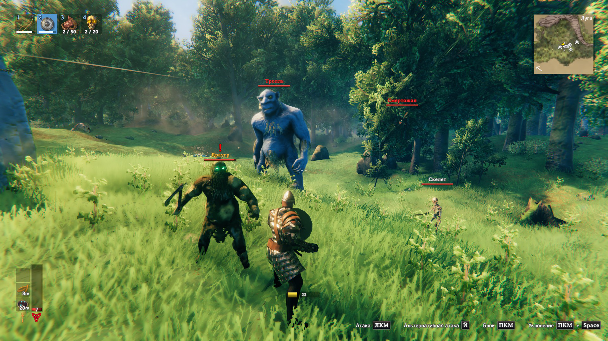

# Valheim Foresight

A combat threat assessment mod that enhances your situational awareness by displaying color-coded threat indicators on enemy nameplates. Know at a glance whether you can safely block, need to parry, or should avoid direct engagement.


## Features

### Real-Time Threat Assessment
Valheim Foresight calculates the effective damage of enemy attacks based on multiple factors:
- Enemy base damage and level
- World difficulty multipliers
- Player count scaling
- Your current armor and shield stats
- Block power vs. Parry power

### Four Threat Levels

The mod displays threat levels through color-coded enemy names:

| Color | Threat Level | Meaning |
|-------|-------------|---------|
| **White** | Safe | You can safely block this attack |
| **Yellow** | Caution | Significant damage but survivable when blocking |
| **Orange** | Block Lethal | Blocking will kill you, but parrying will save you |
| **Red** | Danger | Even a perfect parry won't save you - avoid or prepare to dodge |



### Intelligent Difficulty Scaling

Foresight accounts for Valheim's dynamic difficulty system:
- World progression modifiers
- Multiplayer scaling based on nearby players
- Biome difficulty
- Enemy star levels

### Performance Optimized

- Caches threat calculations to minimize performance impact
- Automatic cleanup of distant/dead enemies
- Configurable update intervals

## Installation

### Requirements
- [BepInEx 5.4.2202+](https://valheim.thunderstore.io/package/denikson/BepInExPack_Valheim/)
- Valheim

### Using a Mod Manager (Recommended)

1. Install [r2modman](https://thunderstore.io/package/ebkr/r2modman/) or [Thunderstore Mod Manager](https://www.overwolf.com/app/Thunderstore-Thunderstore_Mod_Manager)
2. Search for "Valheim Foresight"
3. Click Install

### Manual Installation

1. Download and install [BepInExPack for Valheim](https://valheim.thunderstore.io/package/denikson/BepInExPack_Valheim/)
2. Download the latest Valheim.Foresight.dll from releases
3. Extract and place `Valheim.Foresight.dll` into `BepInEx/plugins/` folder
4. Launch the game

## Configuration

Configuration file is generated at `BepInEx/config/coffeenova.valheim.foresight.cfg` after first launch.

### Available Settings

- **Enable Logs** - Toggle mod logging (default: true)
- **Debug HUD** - Show detailed threat calculation info (default: false)

## Usage

Simply play the game normally! Foresight works automatically in the background:

1. Enemy nameplates will be colored based on threat level
2. Check the color before engaging
3. Adjust your combat strategy accordingly


## How It Works

### Damage Calculation Pipeline

1. **Base Damage Detection**: Extracts weapon damage from enemy's equipped items or attacks
2. **Difficulty Multipliers**: Applies world difficulty and player count scaling
3. **Defense Simulation**: Calculates effective damage after your block/parry power
4. **Threat Classification**: Compares effective damage to your current HP
5. **Visual Feedback**: Updates enemy nameplate color

### Block vs. Parry

The mod distinguishes between blocking and parrying:
- **Block**: Uses your shield's base block power
- **Parry**: Uses 2.5x block power (configurable by shield type)

This is why some attacks show orange (Block Lethal) - they exceed your block power but not your parry power.


## Compatibility

### Confirmed Compatible
- Server-side compatible (clients without the mod won't see threat colors)
- Works with enemy scaling mods that modify damage
- Compatible with HUD mods


## For Developers

### Building from Source

#### Setup

1. Clone the repository
```bash
git clone https://github.com/yourusername/Valheim.Foresight.git
cd Valheim.Foresight
```

2. Set up environment variable `VALHEIM_FORESIGHT_PUBLISH_PATH` pointing to your `BepInEx\plugins\` directory in either:
   - Your Valheim game installation (e.g., `C:\Program Files (x86)\Steam\steamapps\common\Valheim\BepInEx\plugins`)
   - Your r2modman profile (e.g., `%APPDATA%\r2modmanPlus-local\Valheim\profiles\Default\BepInEx\plugins`)

3. Open `Valheim.Foresight.sln` and build

The built DLL will automatically be copied to the specified directory on successful build.


## FAQ

**Q: Does this work in multiplayer?**  
A: Yes! Each client calculates threats independently based on their own stats. You can use it on vanilla servers without server-side installation.

**Q: Why do threat levels change suddenly?**  
A: Threat is recalculated based on your current HP, armor, and shield. Damage or gear changes will update the assessment.

**Q: Can I customize the colors?**  
A: Not yet, but it's planned for a future update.

**Q: Does this give an unfair advantage?**  
A: It displays information you could calculate manually. Think of it as a combat UI improvement rather than a cheat.


## Changelog

[CHANGELOG.md](gallery/thunderstore/CHANGELOG.md)

---
